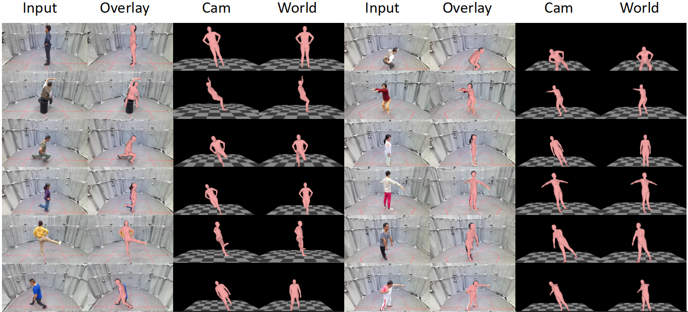

# W-HMR: Human Mesh Recovery in World Space with Weak-supervised Camera Calibration and Orientation Correction

  

## Features

W-HMR is a human body pose and shape estimation method in world space. 
It predicts the SMPL body model in both camera and world coordinates for a monocular image.
[Camera Calibration] predicts the focal length for better mesh-image alignment. 
[Orientation Correction] make recovered body reasonable in world space.

This implementation:
- has the demo code for W-HMR implemented in PyTorch.

## Getting Started

## Running the Demo

### W-HMR

 Codes and pre-trained model will come after publication.

Sample demo output:

  

On the right, they are the output in camera and world coordinate. We put them in world space and generate ground planes to show how accurate the orientation is.

## Training

Training instructions will follow after publication.

## Acknowledgments

Part of the code is borrowed from the following projects, including ,[PyMAF](https://github.com/HongwenZhang/PyMAF), [AGORA](https://github.com/pixelite1201/agora_evaluation), [PyMAF-X](https://github.com/HongwenZhang/PyMAF-X), [PARE](https://github.com/mkocabas/PARE), [SPEC](https://github.com/mkocabas/SPEC), [MeshGraphormer](https://github.com/microsoft/MeshGraphormer), [4D-Humans](https://github.com/shubham-goel/4D-Humans), [VitPose](https://github.com/ViTAE-Transformer/ViTPose). Many thanks to their contributions.
